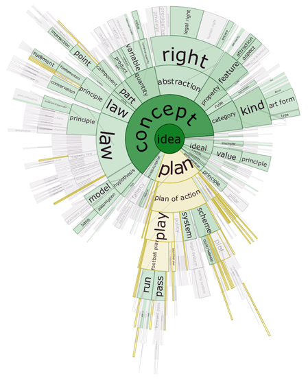
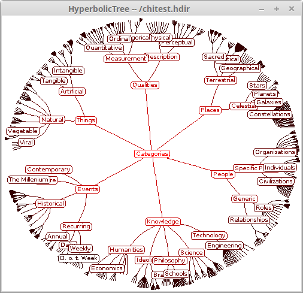

# About Prefuse-ext

This project is a aims a collection of examples revealing the rich possibilities of the library Prefuse.
All changes are released under the same original license.

In my opinion, the library can still be useful in the Java Client Application Platform (RCP).

# About Prefuse

Prefuse is a set of software tools for creating rich interactive data 
visualizations in the Java programming language. 
Prefuse supports a rich set of features for data modeling, visualization, 
and interaction. It provides optimized data structures for tables, graphs, 
and trees, a host of layout and visual encoding techniques, and support 
for animation, dynamic queries, integrated search, and database connectivity. 

Prefuse is written in Java, using the Java 2D graphics library, and is 
easily integrated into Java Swing applications or web applets.

Prefuse is a creation of the [UC Berkeley Visualization Lab] (http://vis.berkeley.edu/). 
For more information see (license-prefuse.txt) and (http://prefuse.org/). 

It was developed until 2007 by its original author, [Jeffrey Heer](http://homes.cs.washington.edu/~jheer/). 

Prefuse is licensed under the terms of a [BSD license](prefuse-core/license-prefuse.txt) and can be freely used for 
both commercial and non-commercial purposes. The original website is at [prefuse.org](http://prefuse.org/).

# Modules

## prefuse-core

Copy of original project [prefuse/Prefuse](https://github.com/prefuse/Prefuse) with refactoring

## prefuse-core-ie

Fork [ieg-vienna/Prefuse](https://github.com/ieg-vienna/Prefuse) with refactoring

## profusians

[Profusians](http://goosebumps4all.net/profusians) is an open source "add on" library for the wonderful prefuse 
visualization toolkit. It aims to

- provide solutions for tasks on top of prefuse
- inspire other prefuse developer to share their insights about prefuse in form of open source
- help to shape/establish the SOS license 

##### social open source license (SOS)

Initially planned as a "new" type of license, we boil it down to the following agreement for the time being 
The profusians library can be used

- in open source projects under GPLv3 license
- in non open source projects if a certain amount is donated to a NGO of your choice 

So basically this software is licensed under GPLv3 and we will find ways for people to use it under a different license 
if requested, just [contact](http://goosebumps4all.net/profusians/wiki/Contact) us.

## prefuse-pleyades

Java classes to extend prefuse. Pleyades platform.

## prefuse-ieg

Common Java classes to extend the InfoVis library prefuse [ieg-vienna/ieg-prefuse](http://github.com/ieg-vienna/ieg-prefuse)

## prefuse-ieg-timeBench

[ieg-vienna/TimeBench](http://github.com/ieg-vienna/TimeBench)

## prefuse-ieg-evalBench

[ieg-vienna/EvalBench](http://github.com/ieg-vienna/EvalBench)

## prefuse-caffe-layout-visualization

[thingumajig/prefuse-caffe-layout-visualization](https://github.com/thingumajig/prefuse-caffe-layout-visualization)

## prefuse-RSFTree

[DocuBurst: Visualizing Document Content using Language Structure](http://faculty.uoit.ca/collins/research/docuburst/index.html)

DocuBurst is the first visualization of document content which takes advantage of the human-created structure in lexical databases. We use an accepted design paradigm to generate visualizations which improve the usability and utility of WordNet as the backbone for document content visualization. A radial, space-filling layout of hyponymy (IS-A relation) is presented with interactive techniques of zoom, filter, and details-on-demand for the task of document visualization. The techniques can be generalized to multiple documents.

Collins, Christopher; Carpendale, Sheelagh; and Penn, Gerald. DocuBurst: Visualizing Document Content using Language Structure. Computer Graphics Forum (Proceedings of Eurographics/IEEE-VGTC Symposium on Visualization (EuroVis '09)), 28(3): pp. 1039-1046, June, 2009.

## prefuse-ext-demos

Demos from:

- [markhm/prefuse_demos](https://github.com/markhm/prefuse_demos)

- [qazxiaye/prefuseDemo_NetTopology](https://github.com/qazxiaye/prefuseDemo_NetTopology)

- [roguh/prefusetreevis](https://github.com/roguh/prefusetreevis)

- [tangwing/MovieGraph](https://github.com/tangwing/MovieGraph)

- [luizvarela/grafos_java](https://github.com/luizvarela/grafos_java)

- [dopl/prefuse-example](https://github.com/dopl/prefuse-example)

- [fajran/ubuntu-pkg-vis-prefuse](https://github.com/fajran/ubuntu-pkg-vis-prefuse)

- [projektlp/opticalNetworkVisualize](https://github.com/projektlp/opticalNetworkVisualize)

- [prefuse assistance pool (PAP)](http://goosebumps4all.net/34all/bb/forumdisplay.php?fid=18)

- [dudka.cz/sgvis](http://dudka.cz/sgvis)

- [etc-groups.sourceforge.net](http://etc-groups.sourceforge.net)

- [VoCAL](http://code.google.com/p/vocal/)

VoCAL: Protégé OWL plugin for visualizing DL concept expressions

- [YAMVIA](http://code.google.com/p/ivipi/)

YAMVIA is - as the name is giving you a hint - another approach struggling with the perfidies that visualization of large Movie-Databases come along with. YAMVIA is performed by students of the University of Tampere, Finland in the course Information Visualization Project Work. The YAMVIA project was previously ran under the name "GMD - Global Movie Database", but as the project emerged we recognized that we have to choose a more appropriate name in order to the challenges that occured. 

## prefuse-alpha

Source codes of version 20050114 are taken and added reverse engineering application prefuse-app (20180114)

Of interest is only the implementation of the Hyperbolic tree. The source text of the Hyperbolic Tree has never 
been published, possibly for patent law reasons.

Reverse engeneering was produced with the help of several java decompilers.
 
*Reverse engineering code is dirty and non stable, but working Hyperbolic tree demo*

